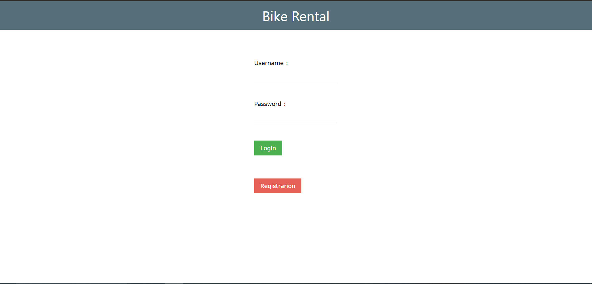
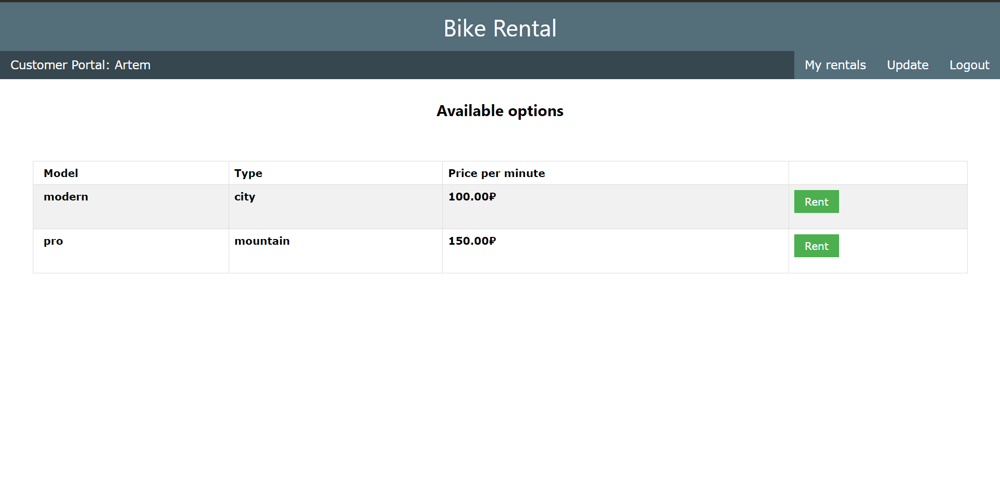
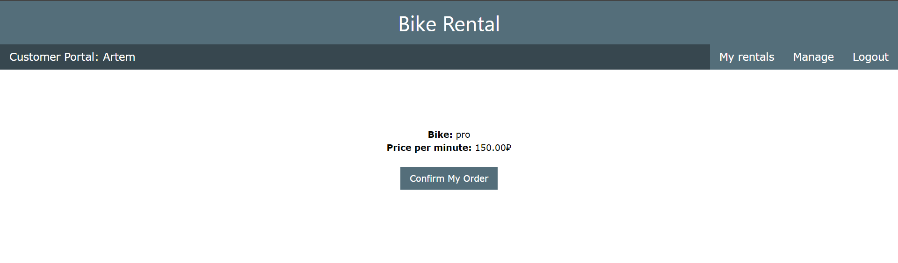
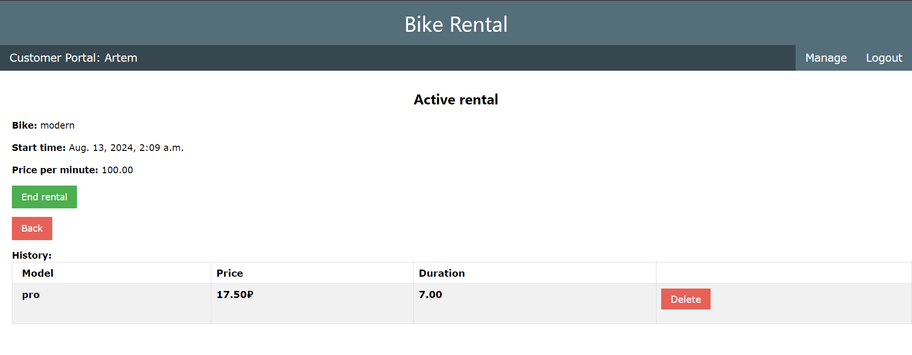

# Bike rental service

## Описание

"Bike rental service" — это микросервис, предназначенный для аренды велосипедов.
 API предоставляет функции для получения списка доступных велосипедов,
информации о их модели и цене, начала аренды, завершения аренды и
расчета стоимости аренды.

## Используемые технологии

[](https://www.python.org/downloads/release/python-3100/)
[](https://docs.djangoproject.com/en/4.2/releases/3.2/)
[](https://www.postgresql.org/)
[](https://www.docker.com/)
[](https://docs.celeryq.dev/en/stable/django/first-steps-with-django.html)
[](https://redis-py.readthedocs.io/en/stable/)

## Запуск проекта
1. **Установка:** Клонируйте репозиторий на свой локальный компьютер.
2. **Настройка окружения:** Запустите виртуальную среду venv, сервер redis, celery и сервер django.
3. **Docker Compose:** Перейдите в каталог проекта и выполните следующие
   команды, чтобы запустить приложение с использованием Docker Compose

```bash
docker compose up --build
```

4. **Доступ к приложению:** После того, как Docker Compose закончит настройку
   окружения, вы сможете получить доступ к регистрации на портале, перейдя по
   адресу http://127.0.0.1/. 
   Для доступа к админ-зоне пройдите по адресу http://127.0.0.1/admin/, суперпользователь создан автоматически (`логин: admin, пароль:
   admin`)

## Основные возможности

1. **Аренда велосипеда**:
    - Выбор велосипеда из списка доступных.
    - Начало и завершение аренды.
    
2. **Управление арендой в личном кабинете**:
    - Просмотр информации о текущей аренде.
    - Завершение текущей аренды.
    - Хранение истории о предыдущих арендах.

## Пример работы приложения
Вход и регистрация.


Главная страница со списком доступных велосипедов.


Подтверждение аренды.


Личный кабинет с историей аренды.    
